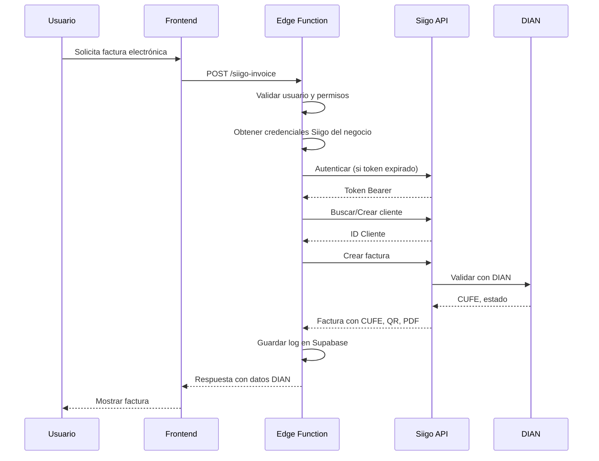

# 🧾 Integración Siigo - Facturación Electrónica DIAN

## Índice
1. [Descripción General](#descripción-general)
2. [Arquitectura](#arquitectura)
3. [Flujo de Facturación](#flujo-de-facturación)
4. [Configuración](#configuración)
5. [Uso desde Frontend](#uso-desde-frontend)
6. [Manejo de Errores](#manejo-de-errores)
7. [Seguridad](#seguridad)
8. [Consideraciones Legales](#consideraciones-legales)

---

## Descripción General

Esta integración permite a los negocios registrados en Stocky generar **facturas electrónicas válidas ante la DIAN** a través de la API de Siigo, proveedor tecnológico autorizado.

### Características:
- ✅ Autenticación OAuth con caché de tokens
- ✅ Creación automática de clientes en Siigo
- ✅ Generación de facturas electrónicas
- ✅ Obtención de CUFE, QR y PDF
- ✅ Validación DIAN en tiempo real
- ✅ Logs de auditoría completos
- ✅ Soporte multi-tenant (cada negocio tiene sus credenciales)

---

## Arquitectura

```
┌─────────────────┐     ┌───────────────────┐     ┌─────────────┐
│   Frontend      │────▶│  Edge Function    │────▶│  Siigo API  │
│   (React)       │     │  (Deno/TypeScript)│     │             │
└─────────────────┘     └───────────────────┘     └─────────────┘
                               │                        │
                               ▼                        ▼
                        ┌─────────────┐          ┌─────────────┐
                        │  Supabase   │          │    DIAN     │
                        │  Database   │          │             │
                        └─────────────┘          └─────────────┘
```

### Componentes:

| Componente | Ubicación | Descripción |
|------------|-----------|-------------|
| Edge Function | `supabase/functions/siigo-invoice/` | Lógica de integración con Siigo |
| Migración SQL | `supabase/migrations/20260114_siigo_integration.sql` | Tablas y políticas RLS |
| Servicio JS | `src/services/siigoService.js` | Cliente para frontend |
| Hook React | `src/hooks/useSiigoInvoice.js` | Hook para componentes |

---

## Flujo de Facturación



### Pasos detallados:

1. **Usuario solicita factura** → El frontend recopila datos del cliente y productos
2. **Validación local** → El servicio valida campos requeridos antes de enviar
3. **Autorización** → Edge Function verifica que el usuario pertenece al negocio
4. **Credenciales** → Se obtienen las credenciales Siigo del negocio (encriptadas)
5. **Autenticación Siigo** → Se obtiene token Bearer (con caché de 55 minutos)
6. **Cliente** → Se busca o crea el cliente en Siigo
7. **Factura** → Se crea la factura y se envía a la DIAN
8. **Respuesta** → Se retorna CUFE, código QR, PDF y estado DIAN

---

## Configuración

### 1. Secrets de Supabase

```bash
# Configurar URL de API Siigo
supabase secrets set SIIGO_API_URL=https://api.siigo.com

# Si usas ambiente de pruebas
supabase secrets set SIIGO_API_URL=https://api.siigo.com/sandbox
```

### 2. Ejecutar Migración

```bash
# En Supabase Dashboard → SQL Editor
# Ejecutar el contenido de: supabase/migrations/20260114_siigo_integration.sql
```

### 3. Desplegar Edge Function

```bash
supabase functions deploy siigo-invoice
```

### 4. Configurar Credenciales del Negocio

Las credenciales se configuran por negocio en la tabla `business_siigo_credentials`:

```sql
INSERT INTO business_siigo_credentials (
    business_id,
    siigo_username,
    siigo_access_key,
    is_enabled,
    is_production,
    resolution_number,
    resolution_prefix,
    resolution_from,
    resolution_to,
    resolution_valid_from,
    resolution_valid_to
) VALUES (
    'uuid-del-negocio',
    'usuario@empresa.com',
    'clave-acceso-siigo',
    true,
    true,
    '18764000001234',
    'SETT',
    1,
    5000,
    '2025-01-01',
    '2026-12-31'
);
```

---

## Uso desde Frontend

### Ejemplo Básico

```jsx
import { useSiigoInvoice } from '../hooks/useSiigoInvoice'

function InvoiceButton({ sale, customer }) {
  const { createInvoiceFromSale, loading, error, lastInvoice } = useSiigoInvoice(businessId)

  const handleCreateInvoice = async () => {
    const result = await createInvoiceFromSale(sale, customer)
    
    if (result.success) {
      console.log('CUFE:', result.cufe)
      console.log('PDF:', result.pdf_url)
      // Mostrar éxito al usuario
    } else if (result.isInformativeOnly) {
      // Negocio no habilitado - mostrar advertencia
      alert(result.message)
    } else {
      // Error - mostrar mensaje
      console.error(result.error)
    }
  }

  return (
    <button onClick={handleCreateInvoice} disabled={loading}>
      {loading ? 'Generando...' : 'Generar Factura Electrónica'}
    </button>
  )
}
```

### Ejemplo Completo con Validación

```jsx
import { useState } from 'react'
import { useSiigoInvoice, useDaneCities } from '../hooks/useSiigoInvoice'
import { siigoService } from '../services/siigoService'

function InvoiceForm({ sale, businessId }) {
  const { createInvoice, loading, error, ID_TYPES, PAYMENT_METHODS } = useSiigoInvoice(businessId)
  const { cities, searchCities } = useDaneCities()
  
  const [customer, setCustomer] = useState({
    identification: '',
    id_type: 'CC',
    name: '',
    email: '',
    address: '',
    city_code: 11001,
    phone: '',
    check_digit: '',
  })

  const handleSubmit = async (e) => {
    e.preventDefault()

    // Preparar datos
    const invoiceData = siigoService.prepareSaleForInvoice(sale, customer, businessId)
    
    // Validar antes de enviar
    const errors = siigoService.validateInvoiceData(invoiceData)
    if (errors.length > 0) {
      alert('Errores:\n' + errors.join('\n'))
      return
    }

    // Crear factura
    const result = await createInvoice(invoiceData)

    if (result.success) {
      // Mostrar resultado
      showInvoiceResult(result)
    }
  }

  return (
    <form onSubmit={handleSubmit}>
      {/* Tipo de documento */}
      <select 
        value={customer.id_type}
        onChange={(e) => setCustomer({...customer, id_type: e.target.value})}
      >
        {Object.entries(ID_TYPES).map(([code, info]) => (
          <option key={code} value={code}>{info.name}</option>
        ))}
      </select>

      {/* Número de documento */}
      <input
        type="text"
        placeholder="Número de documento"
        value={customer.identification}
        onChange={(e) => setCustomer({...customer, identification: e.target.value})}
        required
      />

      {/* Dígito verificación (solo NIT) */}
      {customer.id_type === 'NIT' && (
        <input
          type="text"
          placeholder="DV"
          maxLength={1}
          value={customer.check_digit}
          onChange={(e) => setCustomer({...customer, check_digit: e.target.value})}
          required
        />
      )}

      {/* Otros campos... */}
      <input
        type="text"
        placeholder="Nombre completo"
        value={customer.name}
        onChange={(e) => setCustomer({...customer, name: e.target.value})}
        required
      />

      <input
        type="email"
        placeholder="Email"
        value={customer.email}
        onChange={(e) => setCustomer({...customer, email: e.target.value})}
        required
      />

      <input
        type="text"
        placeholder="Dirección"
        value={customer.address}
        onChange={(e) => setCustomer({...customer, address: e.target.value})}
        required
      />

      {/* Ciudad (búsqueda) */}
      <input
        type="text"
        placeholder="Buscar ciudad..."
        onChange={(e) => searchCities(e.target.value)}
      />
      <select onChange={(e) => setCustomer({...customer, city_code: parseInt(e.target.value)})}>
        {cities.map(city => (
          <option key={city.city_code} value={city.city_code}>
            {city.city_name}, {city.department_name}
          </option>
        ))}
      </select>

      <button type="submit" disabled={loading}>
        {loading ? 'Procesando...' : 'Generar Factura DIAN'}
      </button>

      {error && <div className="error">{error}</div>}
    </form>
  )
}
```

### Payload de Ejemplo

```json
{
  "business_id": "550e8400-e29b-41d4-a716-446655440000",
  "customer": {
    "identification": "1234567890",
    "id_type": "CC",
    "name": "Juan Carlos Pérez",
    "email": "juan.perez@email.com",
    "address": "Calle 100 #15-20 Apto 501",
    "city_code": 11001,
    "phone": "3001234567"
  },
  "items": [
    {
      "code": "PROD-001",
      "description": "Hamburguesa Premium",
      "quantity": 2,
      "unit_price": 28000,
      "tax_percentage": 19,
      "discount_percentage": 0
    },
    {
      "code": "PROD-002",
      "description": "Bebida Natural 500ml",
      "quantity": 2,
      "unit_price": 6000,
      "tax_percentage": 19,
      "discount_percentage": 0
    }
  ],
  "payment": {
    "method": "CASH",
    "value": 80920
  },
  "observations": "Gracias por su compra"
}
```

### Respuesta Exitosa

```json
{
  "success": true,
  "message": "Factura electrónica generada exitosamente",
  "data": {
    "siigo_id": "12345678",
    "invoice_number": "SETT-1234",
    "cufe": "a1b2c3d4e5f6g7h8i9j0k1l2m3n4o5p6q7r8s9t0",
    "qr_code": "https://catalogo-vpfe.dian.gov.co/document/searchqr?documentkey=...",
    "pdf_url": "https://api.siigo.com/v1/invoices/12345678/pdf",
    "dian_status": "ACCEPTED"
  }
}
```

---

## Manejo de Errores

### Códigos de Error

| Código | Descripción | Acción Recomendada |
|--------|-------------|-------------------|
| `BUSINESS_NOT_ENABLED` | Negocio no habilitado para facturar | Mostrar aviso informativo |
| `SIIGO_CREDENTIALS_MISSING` | No hay credenciales configuradas | Contactar administrador |
| `SIIGO_AUTH_INVALID` | Credenciales Siigo inválidas | Verificar usuario/clave en Siigo |
| `SIIGO_CUSTOMER_ERROR` | Error con datos del cliente | Verificar documento/email |
| `SIIGO_NUMBERING_ERROR` | Numeración agotada o no configurada | Configurar numeración en Siigo |
| `SIIGO_INVOICE_ERROR` | Error general de factura | Ver detalles específicos |
| `INTERNAL_ERROR` | Error interno del servidor | Reintentar o contactar soporte |

### Ejemplo de Manejo

```jsx
const handleInvoiceResult = (result) => {
  if (result.success) {
    showSuccess('Factura generada exitosamente')
    downloadPDF(result.pdf_url)
    return
  }

  switch (result.error_code) {
    case 'BUSINESS_NOT_ENABLED':
      showWarning({
        title: 'Documento Informativo',
        message: 'Este comprobante NO es una factura electrónica válida ante la DIAN.',
        action: 'Generar comprobante informativo'
      })
      break

    case 'SIIGO_NUMBERING_ERROR':
      showError({
        title: 'Numeración Agotada',
        message: 'La numeración de facturación se agotó o no está configurada.',
        action: 'Contactar al administrador'
      })
      break

    default:
      showError({
        title: 'Error de Facturación',
        message: result.error,
        details: result.details
      })
  }
}
```

---

## Seguridad

### Medidas Implementadas

1. **Credenciales Encriptadas**
   - Las credenciales Siigo se almacenan en Supabase (encriptación en reposo)
   - Nunca se exponen al frontend

2. **Row Level Security (RLS)**
   - Solo admins/owners pueden ver/editar credenciales
   - Usuarios del negocio solo pueden ver logs de sus facturas

3. **Validación de Permisos**
   - La Edge Function verifica que el usuario pertenece al negocio
   - Se usa el token JWT del usuario para autorizar

4. **Token Caching**
   - Los tokens Siigo se cachean para evitar llamadas innecesarias
   - Renovación automática 5 minutos antes de expirar

5. **Logs de Auditoría**
   - Cada intento de facturación se registra
   - Se guardan request/response para debugging

### Buenas Prácticas

```javascript
// ✅ CORRECTO: Usar el servicio que llama a la Edge Function
const result = await siigoService.createInvoice(data)

// ❌ INCORRECTO: Nunca llamar a Siigo directamente desde el frontend
const result = await fetch('https://api.siigo.com/v1/invoices', {...})

// ✅ CORRECTO: Validar antes de enviar
const errors = siigoService.validateInvoiceData(data)
if (errors.length > 0) { /* mostrar errores */ }

// ❌ INCORRECTO: Almacenar credenciales en el frontend
localStorage.setItem('siigoKey', 'abc123') // NUNCA hacer esto
```

---

## Consideraciones Legales

### Negocios NO Habilitados

Si un negocio **no está habilitado** para facturación electrónica (`is_enabled = false`), el sistema:

1. **NO genera factura electrónica** en Siigo
2. Retorna código `BUSINESS_NOT_ENABLED`
3. El frontend debe mostrar:

```
╔══════════════════════════════════════════════════╗
║       ⚠️ AVISO LEGAL IMPORTANTE                  ║
╠══════════════════════════════════════════════════╣
║                                                  ║
║  Este documento es solo INFORMATIVO.             ║
║                                                  ║
║  NO constituye factura electrónica válida        ║
║  ante la DIAN.                                   ║
║                                                  ║
║  • No tiene CUFE                                 ║
║  • No tiene código QR DIAN                       ║
║  • No tiene validez fiscal                       ║
║                                                  ║
║  Si requiere factura electrónica, solicítela     ║
║  directamente al establecimiento.                ║
║                                                  ║
╚══════════════════════════════════════════════════╝
```

### Verificar Habilitación

```jsx
const { canInvoice, checkCanInvoice } = useSiigoInvoice(businessId)

useEffect(() => {
  checkCanInvoice()
}, [])

return (
  <div>
    {canInvoice ? (
      <InvoiceForm />
    ) : (
      <InformativeReceiptForm />
    )}
  </div>
)
```

---

## Soporte

### Recursos Adicionales

- 📖 [Documentación API Siigo](https://siigoapi.docs.apiary.io/)
- 📖 [Documentación Supabase Edge Functions](https://supabase.com/docs/guides/functions)
- 📖 [Normativa DIAN Facturación Electrónica](https://www.dian.gov.co/fizcalizacioncontrol/herramiabordings/FacturaElectronica/)

### Logs y Debugging

```sql
-- Ver últimas facturas de un negocio
SELECT * FROM siigo_invoice_logs 
WHERE business_id = 'uuid-negocio'
ORDER BY created_at DESC
LIMIT 20;

-- Ver errores recientes
SELECT * FROM siigo_invoice_logs 
WHERE status = 'ERROR'
ORDER BY created_at DESC
LIMIT 10;

-- Estadísticas del mes
SELECT * FROM get_invoice_stats(
    'uuid-negocio',
    CURRENT_DATE - INTERVAL '30 days',
    CURRENT_DATE
);
```

---

## Changelog

| Fecha | Versión | Cambios |
|-------|---------|---------|
| 2026-01-14 | 1.0.0 | Versión inicial con autenticación, creación de facturas y manejo de errores |
