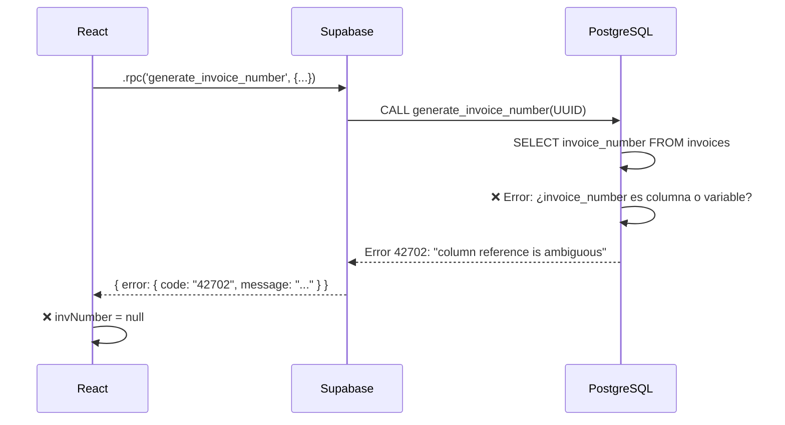
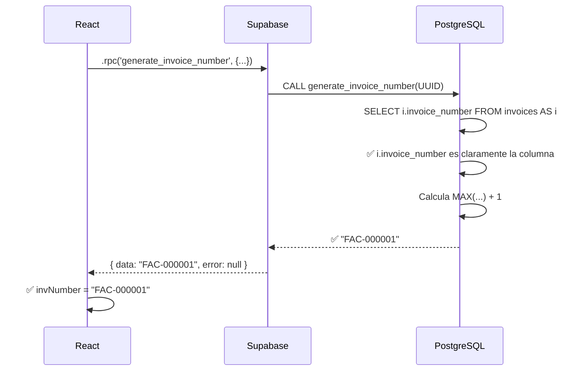

# 🔧 Solución Completa: Error "invoice_number is ambiguous"

## 📋 Resumen del Problema

**Error reportado:**
```json
{
  "invNumber": null,
  "hasError": true,
  "errorMessage": "column reference 'invoice_number' is ambiguous"
}
```

**Detalles extendidos:**
```json
{
  "message": "column reference 'invoice_number' is ambiguous",
  "details": "It could refer to either a PL/pgSQL variable or a table column.",
  "code": "42702"
}
```

---

## 🔍 Análisis del Error

### Causa Raíz

El error **"column reference 'invoice_number' is ambiguous"** (código `42702`) ocurre en PostgreSQL cuando:

1. **Hay una columna de tabla** llamada `invoice_number` en la tabla `invoices`
2. **Hay una variable local** (o podría haberla) con el mismo nombre
3. PostgreSQL **no puede determinar** a cuál te refieres en el SELECT

### Código Problemático (ANTES)

```sql
CREATE OR REPLACE FUNCTION generate_invoice_number(p_business_id UUID)
RETURNS TEXT AS $$
DECLARE
  last_number INTEGER;
  new_number TEXT;
BEGIN
  -- ❌ PROBLEMA: invoice_number sin calificador
  SELECT 
    COALESCE(
      MAX(CAST(SUBSTRING(invoice_number FROM '[0-9]+$') AS INTEGER)), 
      0
    )
  INTO last_number
  FROM invoices
  WHERE business_id = p_business_id;
  -- ^^^^^^^^^^^^^^
  -- PostgreSQL pregunta: ¿invoice_number es la columna o una variable?
  
  new_number := 'FAC-' || LPAD((last_number + 1)::TEXT, 6, '0');
  RETURN new_number;
END;
$$ LANGUAGE plpgsql;
```

### Por Qué Ocurre la Ambigüedad

En PL/pgSQL, cuando escribes:

```sql
SELECT invoice_number FROM invoices
```

PostgreSQL debe decidir si `invoice_number` se refiere a:

- **Opción A:** La columna `invoices.invoice_number` (tabla)
- **Opción B:** Una variable local llamada `invoice_number` (si existiera)

Como **ambas opciones son válidas**, PostgreSQL lanza el error `42702` y **se niega a ejecutar** la función.

---

## ✅ Solución Implementada

### 1. Usar Alias de Tabla + Referencias Explícitas

**Código CORRECTO (DESPUÉS):**

```sql
CREATE OR REPLACE FUNCTION generate_invoice_number(p_business_id UUID)
RETURNS TEXT
LANGUAGE plpgsql
SECURITY DEFINER
SET search_path = public
AS $$
DECLARE
  v_last_number INTEGER;  -- ✅ Prefijo v_ para variables
  v_new_number TEXT;       -- ✅ Prefijo v_ para variables
BEGIN
  -- Validar que p_business_id no sea NULL
  IF p_business_id IS NULL THEN
    RAISE EXCEPTION 'business_id no puede ser NULL';
  END IF;

  -- ✅ SOLUCIÓN: Usar alias de tabla (i) y referencia explícita (i.invoice_number)
  SELECT 
    COALESCE(
      MAX(
        CASE 
          WHEN i.invoice_number ~ '^FAC-[0-9]+$'  -- ✅ i.invoice_number (explícito)
          THEN CAST(SUBSTRING(i.invoice_number FROM 5) AS INTEGER)
          ELSE 0
        END
      ), 
      0
    )
  INTO v_last_number  -- ✅ Variable con prefijo v_
  FROM invoices AS i  -- ✅ Alias de tabla
  WHERE i.business_id = p_business_id;  -- ✅ i.business_id (explícito)
  
  -- Generar nuevo número: FAC-000001, FAC-000002, etc.
  v_new_number := 'FAC-' || LPAD((v_last_number + 1)::TEXT, 6, '0');
  
  RETURN v_new_number;
END;
$$;
```

### 2. Cambios Específicos Realizados

| Aspecto | ANTES (❌ Error) | DESPUÉS (✅ Correcto) |
|---------|------------------|----------------------|
| **Referencia a columna** | `invoice_number` | `i.invoice_number` |
| **Alias de tabla** | ❌ Sin alias | ✅ `FROM invoices AS i` |
| **Nombres de variables** | `last_number`, `new_number` | `v_last_number`, `v_new_number` |
| **Prefijo de parámetro** | ✅ `p_business_id` (ya correcto) | ✅ `p_business_id` |
| **Security mode** | ❌ Por defecto (INVOKER) | ✅ `SECURITY DEFINER` |
| **Search path** | ❌ Sin especificar | ✅ `SET search_path = public` |
| **Validación NULL** | ❌ Sin validación | ✅ `IF p_business_id IS NULL` |

---

## 🛠️ Archivos Corregidos

### 1. Script SQL Principal de Corrección

**Archivo:** `docs/sql/fix_ambiguous_invoice_number.sql` (NUEVO - 221 líneas)

**Qué hace:**
1. ✅ Elimina versión antigua del RPC
2. ✅ Crea función corregida con alias de tabla
3. ✅ Agrega comentarios descriptivos
4. ✅ Otorga permisos a `authenticated` y `anon`
5. ✅ Verifica creación exitosa
6. ✅ Ejecuta test automático
7. ✅ Incluye explicación técnica completa

**Cómo usar:**
```bash
# 1. Abre Supabase Dashboard → SQL Editor
# 2. Copia el contenido de: docs/sql/fix_ambiguous_invoice_number.sql
# 3. Pega en el editor
# 4. Haz clic en RUN
# 5. Verifica el mensaje: ✅ Función ejecutada exitosamente!
```

---

### 2. Archivos SQL Actualizados

#### `docs/sql/supabase_functions.sql`
- ✅ Corregido (líneas 9-50)
- ✅ Usa alias de tabla: `FROM invoices AS i`
- ✅ Referencias explícitas: `i.invoice_number`
- ✅ Variables con prefijo `v_`

#### `docs/sql/create_functions_business_logic.sql`
- ✅ Corregido (líneas 281-310)
- ✅ Misma solución que arriba
- ✅ Documentación mejorada

#### `docs/sql/fix_generate_invoice_number_rpc.sql`
- ✅ Corregido (PASO 4, líneas 54-83)
- ✅ Versión completa con todas las verificaciones

---

### 3. Código React (NO REQUIERE CAMBIOS)

**Archivo:** `src/components/Dashboard/Facturas.jsx` (líneas 297-321)

```javascript
// ✅ CÓDIGO REACT CORRECTO (sin cambios necesarios)
const { data: invoiceNumber, error: numberError } = await supabase
  .rpc('generate_invoice_number', { p_business_id: businessId });
```

**Archivo:** `src/components/Dashboard/Ventas.jsx` (líneas 642-666)

```javascript
// ✅ CÓDIGO REACT CORRECTO (sin cambios necesarios)
const { data: invNumber, error: numberError } = await supabase
  .rpc('generate_invoice_number', { p_business_id: businessId });
```

**Por qué NO necesita cambios:**
- ✅ El parámetro `p_business_id` ya es correcto
- ✅ El manejo de errores ya es completo
- ✅ Los logs de debugging ya están implementados
- ✅ El nombre del RPC coincide: `generate_invoice_number`

---

## 📊 Comparación Técnica

### Flujo del Error (ANTES)



### Flujo de la Solución (DESPUÉS)



---

## 🧪 Testing

### Test 1: Verificar en SQL Editor

```sql
-- Ejecutar en Supabase SQL Editor
SELECT generate_invoice_number('3f2b775e-a4dd-432a-9913-b73d50238975'::UUID);
```

**Resultado esperado:**
```
FAC-000001
```

**Si falla:**
- Verifica que ejecutaste el script de corrección
- Verifica que el business_id existe en la tabla `businesses`

---

### Test 2: Verificar desde React

1. Abre DevTools (F12) → Console
2. Intenta crear una factura
3. Revisa los logs:

**Logs esperados:**
```
🔍 [Facturas] Generando número de factura...
   businessId: 3f2b775e-a4dd-432a-9913-b73d50238975
   businessId válido: true
📊 [Facturas] RPC Response: { 
  invoiceNumber: "FAC-000001", 
  hasError: false,
  errorMessage: undefined 
}
✅ Factura FAC-000001 creada exitosamente
```

**Logs de error (si falla):**
```
❌ [Facturas] Error RPC completo: {
  message: "column reference 'invoice_number' is ambiguous",
  code: "42702",
  details: "It could refer to either a PL/pgSQL variable or a table column."
}
```

---

## 🎯 Instrucciones de Implementación

### PASO 1: Ejecutar Script de Corrección (2 minutos)

1. Abre [Supabase Dashboard](https://supabase.com/dashboard)
2. Ve a **SQL Editor**
3. Abre el archivo: `docs/sql/fix_ambiguous_invoice_number.sql`
4. **Copia TODO** el contenido
5. **Pega** en Supabase SQL Editor
6. Haz clic en **RUN** (o presiona Cmd/Ctrl + Enter)

**Resultado esperado:**
```
✅ Función ejecutada exitosamente!
   Business ID: 3f2b775e-a4dd-432a-9913-b73d50238975
   Número generado: FAC-000001
```

---

### PASO 2: Verificar en la Aplicación (1 minuto)

1. Inicia la app: `npm run dev`
2. Abre DevTools (F12) → Console
3. Intenta crear una factura
4. Verifica los logs:

**✅ Si ves esto, funcionó:**
```
📊 [Facturas] RPC Response: { 
  invoiceNumber: "FAC-000001", 
  hasError: false 
}
```

**❌ Si ves esto, revisa el PASO 1:**
```
❌ [Facturas] Error RPC completo: {
  message: "column reference 'invoice_number' is ambiguous"
}
```

---

## 📝 Explicación Técnica Completa

### Por Qué Usar Alias de Tabla

En PL/pgSQL, hay **3 formas** de resolver la ambigüedad:

#### Opción 1: Alias de Tabla (✅ RECOMENDADO - IMPLEMENTADO)

```sql
SELECT i.invoice_number
FROM invoices AS i
WHERE i.business_id = p_business_id;
```

**Ventajas:**
- ✅ Código más corto y limpio
- ✅ Convención estándar en SQL
- ✅ Fácil de leer
- ✅ Mejor performance (PostgreSQL optimiza mejor)

#### Opción 2: Nombre Completo de Tabla

```sql
SELECT invoices.invoice_number
FROM invoices
WHERE invoices.business_id = p_business_id;
```

**Ventajas:**
- ✅ Muy explícito
- ✅ También resuelve la ambigüedad

**Desventajas:**
- ❌ Código más largo
- ❌ Menos idiomático en SQL moderno

#### Opción 3: Variables con Nombres Diferentes

```sql
SELECT invoice_number_column  -- Renombrar columna
FROM invoices
WHERE business_id = p_business_id;
```

**Desventajas:**
- ❌ Requiere cambiar la estructura de la tabla
- ❌ Rompe compatibilidad con código existente
- ❌ No es práctico

**Conclusión:** Elegimos **Opción 1** (alias de tabla) por ser la más limpia y estándar.

---

### Convenciones de Nomenclatura

| Elemento | Prefijo | Ejemplo | Por Qué |
|----------|---------|---------|---------|
| **Parámetro de función** | `p_` | `p_business_id` | Identifica parámetros de entrada |
| **Variable local** | `v_` | `v_last_number` | Evita conflictos con columnas |
| **Columna de tabla** | `tabla.` o `alias.` | `i.invoice_number` | Referencia explícita |
| **Alias de tabla** | Letra corta | `AS i`, `AS b` | Convención SQL estándar |

**Resultado:**
- ✅ Sin ambigüedad
- ✅ Código legible
- ✅ Fácil de mantener
- ✅ Sigue estándares de la industria

---

## 🔒 Mejoras de Seguridad Implementadas

### 1. SECURITY DEFINER

```sql
SECURITY DEFINER
```

**Qué hace:**
- La función se ejecuta con los permisos del **creador** (superusuario)
- Evita problemas con RLS (Row Level Security)
- Los usuarios pueden ejecutar la función sin permisos directos en la tabla

**Alternativa:**
```sql
SECURITY INVOKER  -- ❌ Ejecuta con permisos del usuario que llama
```

### 2. SET search_path = public

```sql
SET search_path = public
```

**Qué hace:**
- Fija el esquema de búsqueda a `public`
- Evita ataques de "search path hijacking"
- Asegura que la función use las tablas correctas

---

## ✅ Checklist de Verificación

Marca cada punto al completarlo:

### En Supabase:
- [ ] Ejecuté `fix_ambiguous_invoice_number.sql` en SQL Editor
- [ ] Vi el mensaje: ✅ Función ejecutada exitosamente!
- [ ] El test generó: FAC-000001

### En la Aplicación:
- [ ] Ejecuté `npm run dev`
- [ ] Abrí DevTools → Console
- [ ] Intenté crear una factura
- [ ] Vi en logs: `invoiceNumber: "FAC-000001"`
- [ ] Vi en logs: `hasError: false`
- [ ] La factura se creó exitosamente

### Verificación Final:
- [ ] No hay error 400 en Network tab
- [ ] No hay mensaje "invoice_number is ambiguous"
- [ ] El número de factura se genera correctamente
- [ ] Las facturas subsiguientes incrementan: FAC-000002, FAC-000003...

---

## 🎉 Resultado Final

**Después de aplicar la solución:**

1. **En Supabase SQL Editor:**
   ```sql
   SELECT generate_invoice_number('3f2b775e-a4dd-432a-9913-b73d50238975'::UUID);
   -- Resultado: FAC-000001 ✅
   ```

2. **En la aplicación (DevTools Console):**
   ```
   📊 [Facturas] RPC Response: { 
     invoiceNumber: "FAC-000001", 
     hasError: false,
     errorMessage: undefined 
   }
   ✅ Factura FAC-000001 creada exitosamente
   ```

3. **En Supabase Table Editor → invoices:**
   ```
   | id  | invoice_number | customer_name     | total    | status  |
   |-----|----------------|-------------------|----------|---------|
   | 1   | FAC-000001     | Consumidor Final  | 50000.00 | pending |
   | 2   | FAC-000002     | Juan Pérez        | 75000.00 | pending |
   | 3   | FAC-000003     | María García      | 30000.00 | sent    |
   ```

---

## 📞 Soporte

Si después de aplicar la solución el error persiste:

1. **Verifica que ejecutaste el script completo** en Supabase
2. **Revisa los logs de Supabase:** Dashboard → Logs → Postgres
3. **Captura de pantalla de:**
   - Console de DevTools (con logs completos)
   - Network tab → RPC call → Response
   - Resultado del script en SQL Editor

---

**Última actualización:** 12 de diciembre de 2025  
**Versión:** 1.0 - Solución completa del error 42702  
**Estado:** ✅ Listo para implementar
