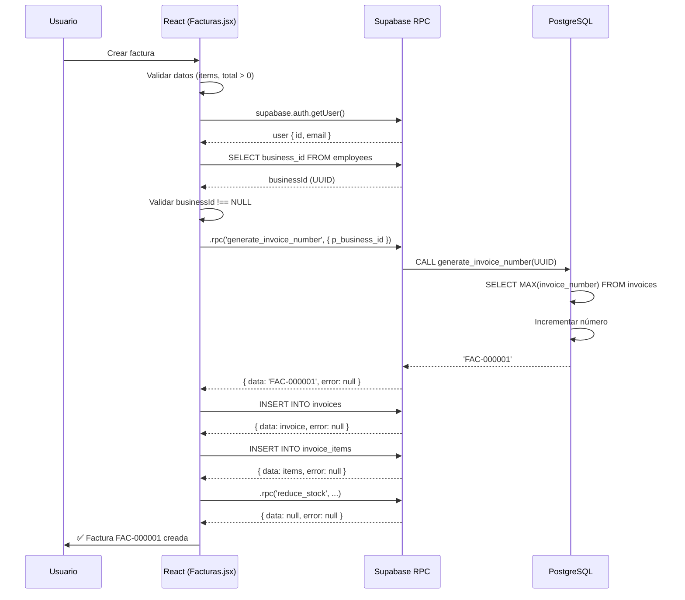

# 🔴 SOLUCIÓN: Error 400 en RPC generate_invoice_number

## 📋 Resumen del Problema

**Error reportado:**
```
POST /rest/v1/rpc/generate_invoice_number → 400 (Bad Request)
Node cannot be found in the current page.
Failed to load resource: the server responded with 400.
```

**Contexto:**
- Al intentar crear una venta y generar factura, Supabase devuelve error 400
- El RPC `generate_invoice_number` no se puede ejecutar
- El error ocurre en `Ventas.jsx` (línea 646) y `Facturas.jsx` (línea 299)

---

## 🔍 Análisis del Problema

### Causa Principal: **Función RPC No Existe o No Tiene Permisos**

El error 400 de Supabase RPC puede tener **5 causas posibles**:

1. ✅ **La función no existe en Supabase**
   - El script SQL nunca se ejecutó
   - La función fue eliminada accidentalmente

2. ✅ **Permisos insuficientes**
   - No se otorgó `GRANT EXECUTE` a usuarios autenticados
   - RLS bloqueando acceso a tabla `invoices`

3. ✅ **Parámetros incorrectos**
   - El nombre del parámetro no coincide: `p_business_id` vs `business_id`
   - El tipo de dato no coincide: UUID vs TEXT

4. ✅ **Función sin SECURITY DEFINER**
   - La función intenta acceder a tablas con RLS sin permisos elevados

5. ✅ **businessId es NULL o inválido**
   - El código React envía NULL en lugar de un UUID válido

---

## 🛠️ Solución Completa

### PASO 1: Ejecutar Script SQL en Supabase

**Archivo:** `docs/sql/fix_generate_invoice_number_rpc.sql`

Este script hace lo siguiente:

1. **Verifica si la función existe**
2. **Elimina versiones antiguas conflictivas**
3. **Crea la función correcta con SECURITY DEFINER**
4. **Otorga permisos a usuarios autenticados**
5. **Ejecuta un test de verificación**

**Instrucciones:**

1. Abre tu proyecto en [Supabase](https://supabase.com/dashboard)
2. Ve a **SQL Editor**
3. Copia y pega el contenido de `docs/sql/fix_generate_invoice_number_rpc.sql`
4. Haz clic en **RUN**
5. Verifica que todos los pasos muestran ✅ (sin errores)

**Resultado esperado:**

```sql
✅ Función ejecutada exitosamente!
   Business ID: 3f2b775e-a4dd-432a-9913-b73d50238975
   Número generado: FAC-000001
```

---

### PASO 2: Verificar Código React

**Archivos afectados:**
- `src/components/Dashboard/Ventas.jsx` (línea 646)
- `src/components/Dashboard/Facturas.jsx` (línea 299)

**Código actual (CORRECTO):**

```javascript
// ✅ CORRECTO
const { data: invoiceNumber, error: numberError } = await supabase
  .rpc('generate_invoice_number', { p_business_id: businessId });

if (numberError) {
  console.error('Error RPC:', numberError);
  throw new Error('Error al generar número de factura: ' + numberError.message);
}
```

**Verificaciones necesarias:**

1. ✅ El parámetro se llama `p_business_id` (con prefijo `p_`)
2. ✅ `businessId` NO es NULL
3. ✅ `businessId` es un UUID válido
4. ✅ El resultado se guarda en `data`, no directamente

**Código incorrecto (NO USAR):**

```javascript
// ❌ INCORRECTO - Parámetro sin prefijo
.rpc('generate_invoice_number', { business_id: businessId })

// ❌ INCORRECTO - businessId es NULL
const businessId = null;
.rpc('generate_invoice_number', { p_business_id: businessId })

// ❌ INCORRECTO - businessId es string vacío
const businessId = '';
.rpc('generate_invoice_number', { p_business_id: businessId })
```

---

### PASO 3: Validar que businessId NO es NULL

**Problema detectado:**

En ambos archivos, se obtiene `businessId` desde la tabla `employees`:

```javascript
const { data: employee } = await supabase
  .from('employees')
  .select('id, business_id')
  .eq('user_id', user.id)
  .eq('is_active', true)
  .maybeSingle();

if (employee) {
  businessId = employee.business_id;
  employeeId = employee.id;
}

if (!businessId) {
  throw new Error('No se encontró información del negocio');
}
```

✅ **Este código está CORRECTO** - ya valida que `businessId` no sea NULL.

---

### PASO 4: Agregar Logging Detallado (Debugging)

Para identificar el problema exacto, vamos a agregar logs temporales:

**En `Facturas.jsx` (línea 295-305):**

```javascript
// Generar número de factura
console.log('🔍 DEBUG - Generando número de factura...');
console.log('   businessId:', businessId);
console.log('   businessId type:', typeof businessId);
console.log('   businessId válido:', businessId && businessId.length === 36);

const { data: invoiceNumber, error: numberError } = await supabase
  .rpc('generate_invoice_number', { p_business_id: businessId });

console.log('📊 RPC Response:', { invoiceNumber, numberError });

if (numberError) {
  console.error('❌ Error RPC completo:', {
    message: numberError.message,
    details: numberError.details,
    hint: numberError.hint,
    code: numberError.code
  });
  throw new Error('Error al generar número de factura: ' + numberError.message);
}
```

**En `Ventas.jsx` (línea 640-650):**

```javascript
// Generar número de factura
console.log('🔍 DEBUG - Generando número de factura desde venta...');
console.log('   businessId:', businessId);
console.log('   selectedSale.id:', selectedSale?.id);

const { data: invNumber, error: numberError } = await supabase
  .rpc('generate_invoice_number', { p_business_id: businessId });

console.log('📊 RPC Response:', { invNumber, numberError });

if (numberError) {
  console.error('❌ Error RPC:', numberError);
  throw new Error('Error al generar número de factura: ' + numberError.message);
}
```

---

## 🧪 Testing y Verificación

### Test 1: Verificar función en Supabase

Ejecuta en SQL Editor:

```sql
-- Test con un business_id real
SELECT generate_invoice_number('3f2b775e-a4dd-432a-9913-b73d50238975'::UUID);
```

**Resultado esperado:**
```
FAC-000001
```

---

### Test 2: Verificar permisos

Ejecuta en SQL Editor:

```sql
-- Verificar que la función tiene permisos
SELECT 
  routine_name,
  grantee,
  privilege_type
FROM information_schema.routine_privileges
WHERE routine_name = 'generate_invoice_number'
  AND routine_schema = 'public';
```

**Resultado esperado:**
```
routine_name              | grantee        | privilege_type
--------------------------|----------------|---------------
generate_invoice_number   | authenticated  | EXECUTE
generate_invoice_number   | anon           | EXECUTE
```

---

### Test 3: Verificar desde la aplicación

1. Abre la aplicación en modo desarrollo
2. Abre DevTools (F12) → Console
3. Intenta crear una factura
4. Revisa los logs en consola:

**Logs esperados:**

```
🔍 DEBUG - Generando número de factura...
   businessId: 3f2b775e-a4dd-432a-9913-b73d50238975
   businessId type: string
   businessId válido: true
📊 RPC Response: { invoiceNumber: "FAC-000001", numberError: null }
✅ Factura FAC-000001 creada exitosamente
```

**Si sigue fallando, verás:**

```
🔍 DEBUG - Generando número de factura...
   businessId: 3f2b775e-a4dd-432a-9913-b73d50238975
   businessId type: string
   businessId válido: true
❌ Error RPC completo: {
  message: "permission denied for function generate_invoice_number",
  details: null,
  hint: null,
  code: "42501"
}
```

---

## 🚨 Troubleshooting Avanzado

### Error: "permission denied for function"

**Causa:** Falta `GRANT EXECUTE`

**Solución:**

```sql
GRANT EXECUTE ON FUNCTION generate_invoice_number(UUID) TO authenticated;
GRANT EXECUTE ON FUNCTION generate_invoice_number(UUID) TO anon;
```

---

### Error: "function does not exist"

**Causa:** La función nunca se creó o se eliminó

**Solución:**

Ejecuta el script completo: `docs/sql/fix_generate_invoice_number_rpc.sql`

---

### Error: "invalid input syntax for type uuid"

**Causa:** `businessId` es NULL, string vacío o no es UUID válido

**Solución:**

Verifica en el código:

```javascript
console.log('businessId:', businessId);
console.log('businessId type:', typeof businessId);

if (!businessId || businessId.length !== 36) {
  throw new Error('businessId inválido: ' + businessId);
}
```

---

### Error: "relation invoices does not exist"

**Causa:** La tabla `invoices` no existe en Supabase

**Solución:**

Verifica que la tabla exista:

```sql
SELECT table_name 
FROM information_schema.tables 
WHERE table_schema = 'public' 
  AND table_name = 'invoices';
```

Si no existe, créala con la estructura correcta.

---

## 📊 Flujo Completo de Generación de Facturas



---

## 📝 Checklist de Solución

Marca cada punto al completarlo:

### En Supabase:

- [ ] Ejecutar script SQL completo (`fix_generate_invoice_number_rpc.sql`)
- [ ] Verificar que la función existe (PASO 1 del script)
- [ ] Verificar permisos GRANT EXECUTE (PASO 6 del script)
- [ ] Ejecutar test de la función (PASO 8 del script)
- [ ] Verificar tabla `invoices` existe (PASO 9 del script)

### En el Código React:

- [ ] Verificar que `businessId` se obtiene correctamente
- [ ] Agregar logs de debugging (console.log)
- [ ] Validar que `businessId` NO es NULL antes del RPC
- [ ] Verificar que el parámetro es `{ p_business_id: businessId }`
- [ ] Capturar y loggear errores completos

### Testing:

- [ ] Test 1: Función en SQL Editor ✅
- [ ] Test 2: Verificar permisos ✅
- [ ] Test 3: Crear factura desde la app ✅
- [ ] Verificar logs en DevTools
- [ ] Confirmar que el número se genera (FAC-000001)

---

## ✅ Resultado Esperado

Después de aplicar todas las correcciones:

1. **En Supabase SQL Editor:**
   ```sql
   SELECT generate_invoice_number('3f2b775e-a4dd-432a-9913-b73d50238975'::UUID);
   -- Resultado: FAC-000001
   ```

2. **En la aplicación (DevTools Console):**
   ```
   🔍 DEBUG - Generando número de factura...
      businessId: 3f2b775e-a4dd-432a-9913-b73d50238975
   📊 RPC Response: { invoiceNumber: "FAC-000001", numberError: null }
   ✅ Factura FAC-000001 creada exitosamente
   ```

3. **En Supabase Dashboard → Logs:**
   ```
   [RPC] generate_invoice_number executed successfully
   [INSERT] invoices - 1 row inserted
   [INSERT] invoice_items - 3 rows inserted
   ```

---

## 🎯 Próximos Pasos

1. **Ejecutar el script SQL** en Supabase
2. **Agregar logs de debugging** en React
3. **Testear creación de factura** desde la app
4. **Revisar logs** en DevTools y Supabase
5. **Reportar resultados** con capturas de pantalla si sigue fallando

---

## 📞 Soporte Adicional

Si después de aplicar todas las correcciones el error persiste:

1. **Captura de pantalla de:**
   - Logs en DevTools (Console tab)
   - Respuesta del RPC en Network tab
   - Logs de Supabase (Dashboard → Logs)

2. **Verifica:**
   - Versión de `@supabase/supabase-js` en `package.json`
   - Variables de entorno (`.env.local`):
     - `VITE_SUPABASE_URL`
     - `VITE_SUPABASE_ANON_KEY`

3. **Ejecuta:**
   ```sql
   -- En Supabase SQL Editor
   SELECT version(); -- Versión de PostgreSQL
   SELECT * FROM pg_available_extensions WHERE name = 'uuid-ossp';
   ```

---

**Última actualización:** 12 de diciembre de 2025  
**Archivo:** `docs/SOLUCION_ERROR_400_RPC_FACTURACION.md`
